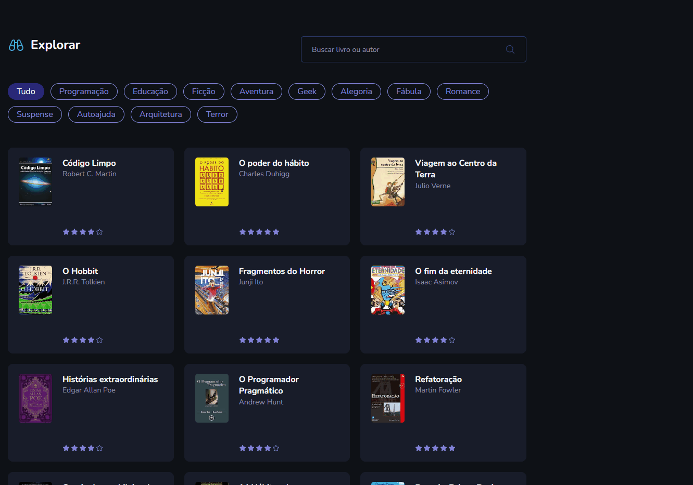
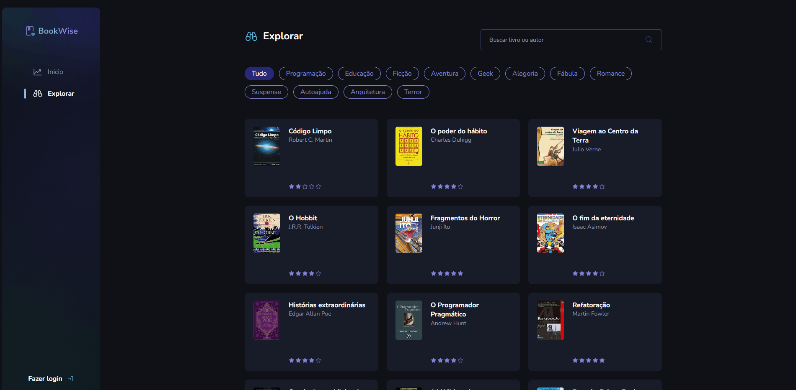
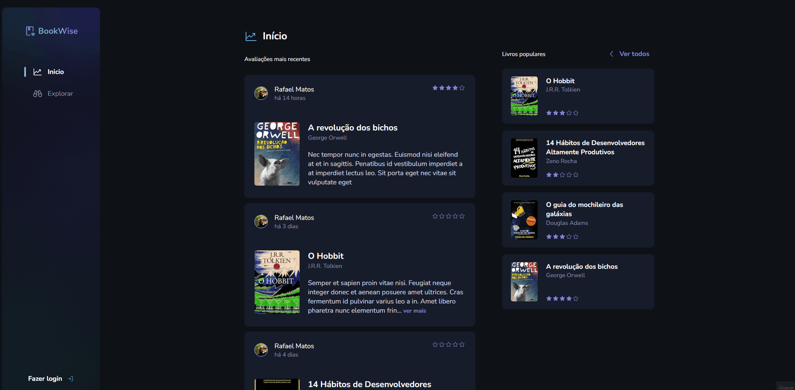

# BookWise 📖

Projeto full-stack em desenvolvimento como desafio do último módulo da trilha React do curso Ignite na Rocketseat🚀 , utilizando Next como principal ferramenta. Vamos criar uma aplicação completa até o deploy. Abordaremos rotas autenticadas no Next.js conceito de Backend-for-Frontend e na aplicação você já pode:

- Fazer login com conta Google ou Github, ou entrar como visitante;
- Fazer filtragem de livros por categoria na página explore
- Fazer busca de livro por nome do livro ou autor
- Avaliar livro adicionando comentário e nota para o livro.


<!-- <details>
    <summary>Responsivo</summary>
    
</details> -->

## Tecnologias usadas ⚙

- Next.js
- React.js
- Typescript
- NextAuth.js
- Prisma
- TanStack
- Axios
- React-query
- Radix-ui
- Zod
<!-- - Ignite-ui
- Zod
- React Hook Form
- Prisma
- Axios
- Nookies
- DayJs
- Google Apis -->

## Atualizações 🔃

  <details>
    <summary>Histórico</summary>

    - Layout da pagina home criada
    - Configurando NextAuth para autenticação com providers
    - Fazendo autenticação com Github
    - Fazendo autenticação com Google
    - Iniciado layout da aplicação
    - Criado sidebar da aplicação
    - Criando sessão de ultimas avaliações
    - Criando sessão Livros populares 
    - Feito seed de informações no banco de dados
    - Sessão ultimas avaliações e livros populares retornando livros do banco
</details>

  
  - Criando página explore
  - Página explore retornando categorias de livros
  - <details>
    <summary>Página explore retornando card de livros e fazendo filtragem por categoria</summary>
    
    </details> 
  - Adicionada busca de livros por nome do livro ou autor
  - Criado modal de detalhes do livro
  - <details>
    <summary>Criando sessão de avaliações do livro</summary>
    
    </details>
  - Modal de avaliação de livro recebendo do banco as informações do livro selecionado
  - Criando formulario de avaliação de livro
  - Salvando novas avaliações dos livros
  - <details>
    <summary>Prevenindo de usuário não logado de fazer avaliação no livro</summary>
    
    </details>
  - Criando página de perfil do usuário
  - Adicionada sessão de detalhes de perfil do usuário
  - <details>
    <summary>Adicionada opção de pesquisa de livro nas avaliações do perfil do usuário</summary>
    
    </details>


  
  

## Como utilizar

- Clone o projeto do repositório

```
git clone https://github.com/RafaelMatos/bookwise
```

- Acesse a pasta do projeto

```
cd bookwise
```

- Instale as dependências

```
npm install
```
- Criar arquivo .env com as chaves necessarias( seguir arquivo .envExample)

- Inicializa o Prisma( Usar banco de dados de sua preferencia, no exemplo é usado o sqlite)

```
npx prisma init --datasource-provider sqlite
```
- Realiza as migrations do Prisma

```
npx prisma migrate dev --name init
```

- Execute o projeto

```
npm run dev
```

- Acesse no navegador o endereço indicado no terminal