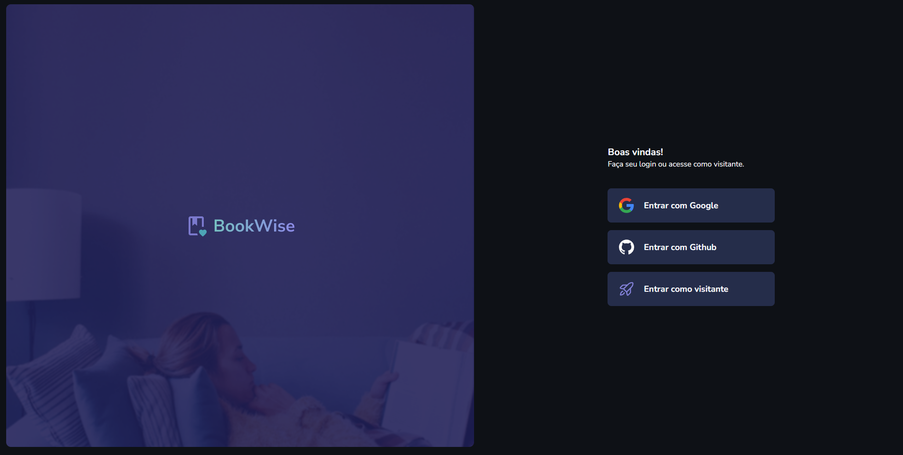
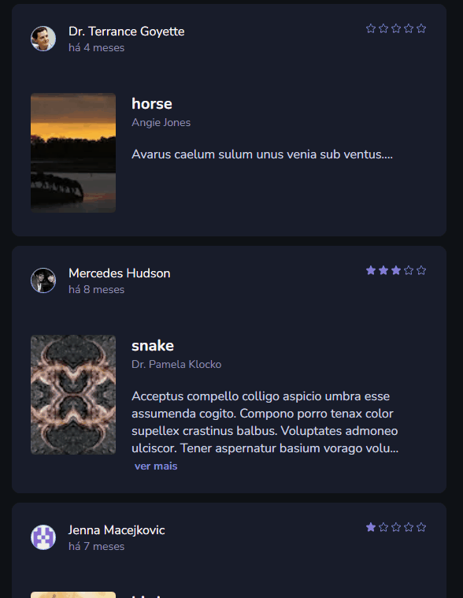

# BookWise 📖

Projeto full-stack em desenvolvimento como desafio do ultimo módulo da trilha React do curso Ignite na Rocketseat🚀 , utilizando Next como principal ferramenta. Vamos criar uma aplicação completa até o deploy. Abordaremos rotas autenticadas no Next.js conceito de Backend-for-Frontend e muito mais!



<!-- <details>
    <summary>Responsivo</summary>
    
</details> -->

## Tecnologias usadas ⚙

- Next.js
- React.js
- Typescript
- NextAuth.js
- Prisma
- TanStack
- Axios
<!-- - Ignite-ui
- Zod
- React Hook Form
- Prisma
- Axios
- Nookies
- DayJs
- Google Apis -->

## Atualizações 🔃

  <details>
    <summary>Histórico</summary>

    - Layout da pagina home criada
    - Configurando NextAuth para autenticação com providers
    - Fazendo autenticação com Github
    - Fazendo autenticação com Google
    - Iniciado layout da aplicação
    - Criado sidebar da aplicação
</details>

  - Criando sessão de ultimas avaliações
  - Criando sessão Livros populares 
  - Feito seed de informações no banco de dados

  
  
  

## Como utilizar

- Clone o projeto do repositório

```
git clone https://github.com/RafaelMatos/bookwise
```

- Acesse a pasta do projeto

```
cd bookwise
```

- Instale as dependências

```
npm install
```
- Criar arquivo .env com as chaves necessarias( seguir arquivo .envExample)

- Inicializa o Prisma( Usar banco de dados de sua preferencia, no exemplo é usado o mysql)

```
npx prisma init --datasource-provider mysql
```
- Realiza as migrations do Prisma

```
npx prisma migrate dev --name init
```

- Execute o projeto

```
npm run dev
```

- Acesse no navegador o endereço indicado no terminal